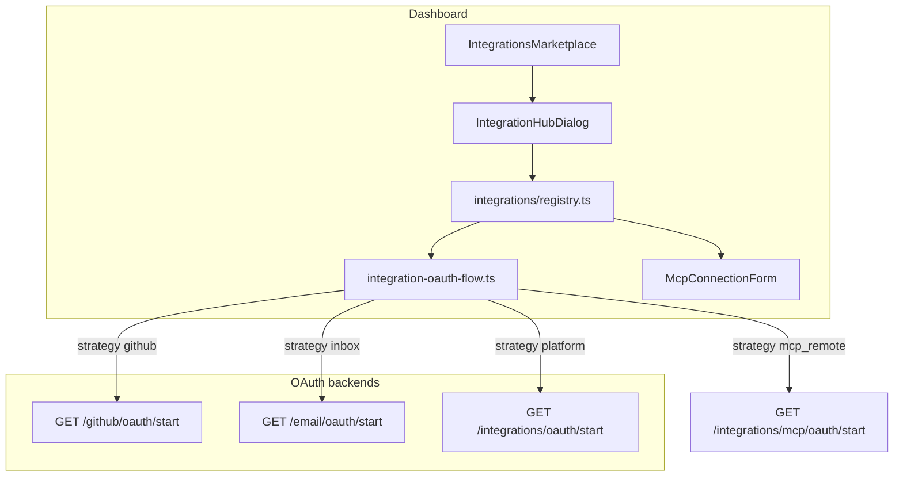

# Integrations — developer guide

How to add or extend integrations in the dashboard marketplace (`/integrations/marketplace`) and on Xano (`api:integrations`).

**Related docs**

- Product behavior: `BOKITO_KNOWLEDGE.md` section 2.6
- Xano deploy checklist: `xano-patches/v1/INTEGRATIONS-PLATFORM.md`
- API env and route pattern: `apps/dashboard/API_CONFIGURATION.md`
- Provider seed UUIDs: `xano-patches/v1/integration-providers-seed.md`
- Frontend provider registry: `apps/dashboard/src/lib/integrations/registry.ts`

---

## Architecture



| Setup mode | UI panel | Primary backend |
|------------|----------|-----------------|
| `oauth2` + strategy `github` | `IntegrationOAuthSetupPanel` | `GET /github/oauth/start` |
| `oauth2` + strategy `inbox` | `IntegrationOAuthSetupPanel` | `GET /email/oauth/start` (JWT required) |
| `oauth2` + strategy `platform` | `IntegrationOAuthSetupPanel` | `GET /integrations/oauth/start` |
| `remote_mcp_oauth` + strategy `mcp_remote` | `IntegrationOAuthSetupPanel` | `GET /integrations/mcp/oauth/start` (runtime PKCE) |
| `api_key` / `custom_mcp` | `IntegrationMcpSetupPanel` | `POST /integrations/mcp/install` |

**In-app guide:** `/integrations/docs` in the portal (sidebar under Integrations).

Unified tables: `integration_hosts` → `integration_providers` → `integration_connections` → `integration_bindings`. Email and legacy GitHub also use parallel tables (see below).

---

## Quick reference: files to touch

| Layer | New MCP provider | New repo OAuth (GitHub-like) | New inbox OAuth (email-like) |
|-------|------------------|------------------------------|------------------------------|
| **Registry** | Entry in `registry.ts` | Entry + `oauthStrategy: 'github'` or `'platform'` | Entry + `oauthStrategy: 'inbox'` |
| **Static catalog** | `integrations-data.ts` | Same | Same |
| **Xano seed** | `integration-providers-seed.md` | Same + OAuth env | Same (catalog only for inbox) |
| **Xano API** | Often none (use `mcp/install`) | `integrations-oauth-start.xs` branch or `/github/*` patches | `/email/oauth/start` pattern |
| **Routes** | `integrations.routes.ts` if new paths | `github.routes.ts` or `integrations.routes.ts` | `integrations.routes.ts` (email section) |
| **OAuth callback** | N/A | `integrations-oauth-callback.xs` or `github/oauth/callback` | `oauth/microsoft/callback`, `oauth/google/callback` |
| **i18n** | `locales/*/nav.json` | Same | Same |

---

## Checklist: MCP provider (fastest path)

### 1. Xano

- [ ] Row in `integration_providers`: `auth_type: api_key`, `capabilities: {"mcp_tools": true}`, fixed UUID in seed doc
- [ ] Row in `integration_hosts` + logo upload
- [ ] Deploy `integrations-mcp-install.xs`, `integrations-mcp-tenant-bindings.xs` if not already live
- [ ] Optional: set default `mcp_server_id` in install patch or in `MCP_PROVIDER_SERVER_IDS` in `mcp-integrations.ts`

### 2. Frontend

- [ ] Add slug to `PLATFORM_PROVIDER_SLUGS` and `INTEGRATIONS` in `integrations-data.ts`
- [ ] Add entry to `PROVIDER_REGISTRY` in `registry.ts` (`setupMode: 'api_key'`, `mcpPreset`, `mcpServerId` if fixed)
- [ ] Slug maps are generated from registry (`SLUG_TO_STATIC_ID` / `STATIC_ID_TO_SLUG`)

### 3. Verify

- [ ] Marketplace card appears after `GET /integrations/providers`
- [ ] Setup opens MCP form; install succeeds
- [ ] `GET /integrations/mcp/bindings` lists binding
- [ ] Connected page shows connection

---

## Checklist: remote MCP OAuth provider

Vendor-hosted MCP servers (Notion, Linear, Slack, etc.) use OAuth 2.1 + PKCE. Token exchange is implemented in **`apps/runtime/src/mcp-oauth/`**; Xano stores state and connections.

### 1. Xano

- [ ] Columns on `integration_providers`: `mcp_remote_url`, `mcp_transport`, `oauth_profile`; `auth_type: mcp_remote_oauth`
- [ ] Columns on `integration_oauth_states`: `code_verifier`, `oauth_client_id`, `mcp_remote_url`, `oauth_profile`
- [ ] Seed row in `integration-providers-seed.md` + host in `integration-hosts-seed.md`
- [ ] Deploy `integrations-mcp-oauth-start.xs`, `integrations-mcp-oauth-callback.xs`, `integrations-worker-mcp-credentials.xs`, `integrations-mcp-oauth-refresh.xs`
- [ ] Env: `RUNTIME_INTERNAL_URL`, `WORKER_INBOUND_SECRET`, `MCP_OAUTH_CALLBACK_URL`, `{PREFIX}_CLIENT_ID`, `_CLIENT_SECRET`, `_REDIRECT_URI`
- [ ] Set provider `status: available` only when OAuth app is registered at vendor

### 2. Frontend

- [ ] Entry in `apps/dashboard/src/lib/mcp-remote-providers.ts` and `integrations/registry.ts` (`setupMode: remote_mcp_oauth`, `oauthStrategy: mcp_remote`)
- [ ] Card in `integrations-data.ts` + `PLATFORM_PROVIDER_SLUGS`
- [ ] Route: `integrationsRoutes.platform.mcpOAuthStart` in `integrations.routes.ts`
- [ ] `startMcpRemoteOAuth` in `integrations-api.ts`; `mcp_remote` branch in `integration-oauth-flow.ts`

### 3. Runtime

- [ ] `MCP_OAUTH_CALLBACK_URL` matches public callback URL
- [ ] Internal routes: `POST /internal/mcp/oauth/start`, `/exchange`, `/refresh` (Bearer `WORKER_INBOUND_SECRET`)

### 4. Verify

- [ ] Marketplace setup opens OAuth panel (not API key form)
- [ ] OAuth round-trip: `?integration=connected&provider=<slug>`
- [ ] `GET /integrations/mcp/bindings` shows `remote_oauth` config
- [ ] `POST /integrations/worker/mcp-credentials` returns access token for agents

Adding provider #11: seed + env + `mcp-remote-providers.ts` only (no new Xano `if provider ==` branches).

---

## Checklist: repository OAuth (GitHub template)

Use for code hosts with OAuth2 and repo indexing. Today GitHub uses a **dedicated** `/github/oauth/start` endpoint (dual-write to `github_oauth_states` and `integration_oauth_states`). New providers can either copy the GitHub patch set or extend generic `integrations/oauth/start` and use `oauthStrategy: 'platform'` in the registry.

### 1. Xano

- [ ] Tables: `github_oauth_states` (or reuse `integration_oauth_states` only), `integration_connections`, optional legacy connection table during migration
- [ ] OAuth app at provider; redirect URI = `GET /github/oauth/callback` or `GET /integrations/oauth/callback`
- [ ] Env: `GITHUB_OAUTH_CLIENT_ID`, `GITHUB_OAUTH_CLIENT_SECRET`, `GITHUB_OAUTH_CALLBACK_URL`
- [ ] Deploy `integrations-github-oauth-start.xs`, `integrations-github-oauth-callback.xs` (or add branch in `integrations-oauth-start.xs` / `integrations-oauth-callback.xs`)
- [ ] Token exchange: use `api.request` with `params` + `Content-Type: application/x-www-form-urlencoded` (not `body` JSON)
- [ ] Provider seed: `auth_type: oauth2`, `capabilities: {"repo_index": true}`, `oauth_config_key` (documentation; env still named per provider today)

### 2. Frontend

- [ ] Registry entry: `oauthStrategy: 'github'` (dedicated routes) or `'platform'` (generic start)
- [ ] `github.routes.ts` or `integrations.routes.ts` path constants
- [ ] `github-api.ts` or call `startIntegrationOAuth` via `integration-oauth-flow.ts`
- [ ] Callback: extend `integrations-oauth.ts` / marketplace banner for new query params
- [ ] Connection count: `connectionCountSource: 'github_api'` or `'platform'` in registry

### 3. Verify

- [ ] Logged-in `GET /api/integrations/github/oauth/start?return_url=...` returns 200 + `authorize_url` (not 404/500)
- [ ] OAuth round-trip lands on marketplace with `?github=connected` or `integration=connected`
- [ ] Row in `integration_connections` (and legacy table if used)
- [ ] Repo bind: `PATCH /workforce/projects/{id}/repo` with `connection_id`

---

## Checklist: inbox OAuth (Outlook / Gmail template)

Inbox providers appear in the unified catalog but store connections in **`email_oauth_connection`**, not `integration_connections`.

### 1. Xano

- [ ] Provider seed for marketplace (`outlook`, `gmail`)
- [ ] `GET /email/oauth/start?provider=outlook|gmail` (or dedicated outlook/google start endpoints)
- [ ] Central callbacks: `GET /oauth/microsoft/callback`, `GET /oauth/google/callback`
- [ ] Env: `MICROSOFT_CLIENT_ID`, `MICROSOFT_CLIENT_SECRET`, `MICROSOFT_REDIRECT_URI`; `GOOGLE_*` equivalents
- [ ] State table: `email_outlook_oauth_state` with `feature` for routing

### 2. Frontend

- [ ] Registry: `oauthStrategy: 'inbox'`, `inboxOAuthProvider: 'outlook' | 'gmail'`
- [ ] Static id mapping: `microsoft-365` ↔ `outlook`, `google-workspace` ↔ `gmail`
- [ ] `connectionCountSource: 'email_outlook' | 'email_gmail'`
- [ ] OAuth panel uses `startOAuthConnection` with auth token

### 3. Verify

- [ ] Setup redirects to Microsoft/Google
- [ ] Return URL shows success banner on marketplace
- [ ] `GET /email/connections` lists mailbox
- [ ] Count on marketplace matches email connections

---

## Deploying Xano API patches

1. Apply tables from `xano-patches/v1-platform-tables.md`.
2. Follow `xano-patches/v1/INTEGRATIONS-PLATFORM.md` for the full endpoint list.
3. Push to workspace via Xano UI, VS Code Xano extension, or metadata API:

```bash
node scripts/push-xano-api.mjs <api_id> xano-patches/v1/<file>.xs
```

Requires root `.env`: `XANO_METADATA_API_KEY`, optional `XANO_META_BASE_URL`.

**Important:** Patches in git are not live until deployed. A 404 on `/github/oauth/start` usually means the patch was never pushed.

---

## Environment variables (integrations group)

| Variable | Used by |
|----------|---------|
| `GITHUB_OAUTH_CLIENT_ID` | GitHub authorize + token exchange |
| `GITHUB_OAUTH_CLIENT_SECRET` | GitHub callback |
| `GITHUB_OAUTH_CALLBACK_URL` | Must match GitHub OAuth app redirect URI exactly |
| `MICROSOFT_CLIENT_ID` / `SECRET` / `REDIRECT_URI` | Outlook OAuth |
| `GOOGLE_CLIENT_ID` / `SECRET` / `REDIRECT_URI` | Gmail OAuth |
| `WORKER_INBOUND_SECRET` | Worker credential endpoints |

---

## Smoke verification (local dev)

Base: `http://bokito.localhost:5174` with Vite proxy to Xano (`/api/integrations/...`).

| Check | Expected |
|-------|----------|
| `GET /api/integrations/providers` (with session) | 200, `providers` array |
| Marketplace load | Five cards, no white screen |
| GitHub Koppelen | 200 `authorize_url` or clear `inputerror` if env missing |
| MCP install | 200, connection + binding |
| Outlook Koppelen | Redirect to Microsoft (requires `token` in session) |

---

## Adding a sixth provider (summary)

1. Choose path: **MCP**, **repo OAuth**, or **inbox OAuth** (table above).
2. Add Xano seed + patches; deploy to workspace.
3. Add registry entry + static card (slug maps follow registry).
4. Run smoke checks; update `BOKITO_KNOWLEDGE.md` if product behavior changes.

Future work (not required for every provider): unify inbox into `integration_connections`, drive OAuth env from `oauth_config_key` in Xano metadata, single generic OAuth router without per-provider `conditional` blocks.
