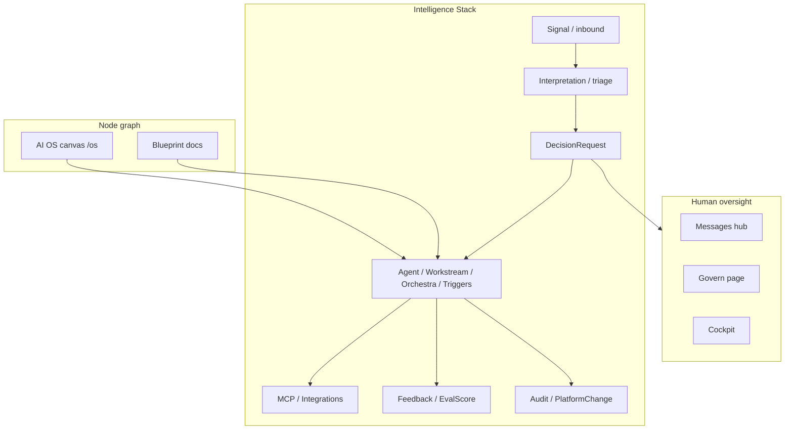

# Bokito Core Intent

Canonical product north star for humans and coding agents. Use this document to judge whether a feature belongs in the architecture before implementation.

**Related:** technical stack map in [`architecture.md`](architecture.md); living operational facts in [`BOKITO_KNOWLEDGE.md`](../BOKITO_KNOWLEDGE.md).

---

## 1. North star — why we exist

**The inbox, the agents, and the approvals — finally in one system.**

Traditional companies coordinate through human layers: managers route work, inboxes fragment attention, and software mirrors org charts. Bokito unifies customer signals, agent orchestration, and human judgment in one operational flow — with **governed autonomy** tenants can dial from manual oversight toward *AI runs operations, humans at the exception layer*.

Under the hood, sensing, interpretation, decision, orchestration, integration, learning, and assurance run as configurable, observable pipelines (the Intelligence Stack). Humans move **up** the stack: oversight, judgment, exception handling, and policy — not down into manually routing every message, approving every routine change, or babysitting agents step by step.

Long-term aim: an operational **digital twin** the business can run on, observe through Cockpit and Govern, and **improve through feedback** — not a collection of one-off automations that never learn or explain themselves.

**Market positioning detail:** [`POSITIONING.md`](POSITIONING.md).

---

## 2. What we are building (in this repo)

A **flexible, node-based agentic OS** that lets SMBs and their operators create and run AI-driven businesses. Every meaningful component is a **node** in a composable graph — agents, workstreams, signals, integrations, blueprint content, canvas layout — so both humans and agents can read, generate, and reshape the system within one semantic model.

### Repo anchors (V1 bokito track)

| Surface | Location | Role |
|---------|----------|------|
| **Backend** | `apps/api` (FastAPI) | Intelligence Stack APIs, agent loop, govern, signals |
| **Portal** | `apps/dashboard` (`VITE_API_MODE=bokito`) | Cockpit, Messages hub, AI OS canvas, Govern, settings |
| **OS canvas** | `/os`, `os_canvas_nodes` / `os_canvas_edges` | Visual graph; domain entities stay in real tables |
| **Unified sensing** | `Signal`, `SignalMessage` | One thread model for external (email, chat, widget) and internal (agent) communication |
| **Messages hub** | `/support/inbox/*`, `/messages` | Single UI for human + agent threads; decisions inline in timeline |
| **Human gates** | `DecisionRequest`, Govern draft queue | Inline approve/defer/reject in threads; structural changes via `PlatformChange` |
| **Self-maintenance** | Agent tools → `propose_platform_change()` | Agents propose graph/agent/integration edits under apply modes and audit |
| **V1 track** | FastAPI `apps/api` | All bokito-mode features use FastAPI + Signal; no parallel legacy stacks |

Intelligence Stack layers are **conceptual lanes** on the canvas and in metrics — not separate top-level navigation tabs. See [`architecture.md`](architecture.md) for the layer-to-code mapping.

---

## 3. Architectural principles

### Node-first

Everything important should map to a **small set of canonical entity types**. Prefer extending:

- `Signal` / `SignalMessage` — conversation context (external and internal)
- `Agent`, `Workstream`, `AgentRun` — orchestration
- `DecisionRequest` — human action objects **within** threads, not parallel list UIs
- `BlueprintBlock`, `BlueprintPage` — structured knowledge
- `os_canvas_nodes` / `os_canvas_edges` — visual graph overlay
- `PlatformChange`, `AuditEvent` — governable mutations

Resist inventing a second inbox, a second decision list, or a second graph when the existing node already expresses the concept.

### Intelligence flow

Features should declare which **stack stage(s)** they serve and what they hand off to next:

| Stage | Question to answer |
|-------|-------------------|
| **Sensing** | What entered the system? From which channel? |
| **Interpretation** | What does it mean (category, urgency, summary)? |
| **Decision** | Does a human need to choose before action? |
| **Orchestration** | Which agent/workstream executes? |
| **Integration** | Which external tool or repo is involved? |
| **Learning** | What outcome can feed back into policy or eval? |
| **Govern & assure** | Is the change scoped, audited, reversible? |

Isolated CRUD screens that do not connect to this loop are incomplete by design.

### Learning by default

When an action produces an outcome users care about, capture something for later improvement:

- User feedback on agent output (`Feedback`)
- Autonomy / escalation metrics (`EvalScore`, Cockpit)
- Policy tightening (`ActionPolicy` modes: manual, whitelist, yolo)

V1 uses **heuristics**, not ML fine-tuning — but the **hook must exist**. A feature that never records success, failure, or human override is unfinished.

### Govern and assure

Agent autonomy is only valuable if it stays **trustworthy**:

- **Autonomy posture** (tenant preset): `manual` | `assisted` | `autonomous` — dials `ActionPolicy.mode` and default `platform_apply_modes` together (`GET/PUT /api/govern/posture`). Default for new tenants: **assisted**.
  - **Manual** — policy `manual`; all structural and canvas changes queue for review; humans approve every agent action class.
  - **Assisted** — policy `whitelist`; structural changes queue in Govern; canvas layout auto-applies; routine whitelisted actions run without escalation.
  - **Autonomous** — policy `yolo`; most structural changes auto-apply; **integrations always require a human decision**; AI runs operations, humans at the exception layer.
- **Permissions** per agent (`permission_scopes_json`, `platform_access.py`)
- **Apply modes** per resource type: `draft`, `yolo`, or `decision` (`resolve_apply_mode()`) — advanced per-resource overrides in Govern beyond posture presets
- **Trace** via `AuditEvent`
- **Reversibility** via `PlatformChange` rollback where supported
- **Human path** for exceptions — never silent structural writes from agents

Structural mutations flow: scope check → propose → (draft queue | yolo | decision) → apply → audit.

### Human at the exception layer

Automate the routine. Surface ambiguity **in context**:

- Approve/defer/reject on the thread timeline (Messages hub)
- Review platform drafts on `/govern`
- Escalate only what policy cannot resolve

Avoid burying attention items in duplicate admin lists or disconnected pages.

---

## 4. Build phase

The product is in the **initial building phase**. Prefer the cleanest design that fits the node model and north star over backward-compatibility shims. Breaking changes to frontend, backend, and database schema are acceptable when they reduce duplicate mental models or parallel stacks. Do not add migration layers or dual APIs unless explicitly requested.

---

## 5. Design constraints

### Simplicity

Prefer the **simplest design** that fits the node model. If a feature needs a second mental model for users or a parallel schema for agents, reconsider before building.

**Example (wrong direction):** separate Support Inbox and Decisions tab for the same conversation context. **Right direction:** Signal-first Messages hub with folder filters and inline decision cards.

### Minimalist UI

The interface should make a complex system feel **calm and obvious**:

- Shared layout primitives (`PageContent`, `EmptyState`, `AppHeader`)
- Design tokens in `apps/dashboard/src/index.css`
- No emoji in UI copy (workspace policy)
- One title per screen; bespoke flows (inbox 3-pane, database grid) stay intentional, not accidental one-offs

### Scalability

Every choice should hold as tenants, agents, nodes, and messages grow:

- Strict **tenant isolation** (`tenant_id` on all domain rows)
- Composable graph instead of hard-coded product modules
- Server-side views/queues rather than client-only filtering at scale

### Alignment test

Before building, ask: *Can this feature be expressed as nodes within the intelligence flow, with an optional human gate?*

If not, **pause and redesign** — or explicitly document why the exception is temporary.

---

## 6. Agent pre-flight checklist

Before implementing a feature, state (even briefly):

1. **Layer** — Which Intelligence Stack stage(s)? (Sensing / Interpretation / Orchestration / Integration / Learning / Govern)
2. **Nodes** — Which entity types are created, read, or updated? Is any **new** type justified?
3. **Flow** — What triggers this, and what happens next in the loop?
4. **Human gate** — `none` | `inline decision` | `Govern draft` | `manual-only`
5. **Autonomy posture** — Does this respect tenant posture and apply modes?
6. **Learning hook** — What outcome is captured for later improvement?
7. **Trust** — Permissions, audit event, rollback path if agents mutate structure
8. **UI surface** — Which existing hub? (Messages, `/os`, `/govern`, Cockpit, settings) — avoid a fourth comms or agent entry point

When you learn new product facts during implementation, log them in [`BOKITO_KNOWLEDGE.md`](../BOKITO_KNOWLEDGE.md) (see `.cursor/rules/bokito-platform-knowledge.mdc`).

---

## 7. Anti-patterns (repo-learned)

Do **not**:

- Add parallel inbox / decision / message APIs for the same user mental model
- Add new top-level rail items per Intelligence Stack layer
- Let agent writes bypass `propose_platform_change()` or tenant apply modes
- Ship features that produce results but never feed Learning or Govern
- Hardcode dashboard API paths outside `apps/dashboard/src/api/routes/`
- Introduce emoji in UI text, labels, or logs
- Duplicate operational documentation here — use `BOKITO_KNOWLEDGE.md` for facts, this doc for **intent**

---

## 8. Further reading

| Document | Purpose |
|----------|---------|
| [`POSITIONING.md`](POSITIONING.md) | Category, ICP, competitors, land-and-expand |
| [`architecture.md`](architecture.md) | Intelligence Stack → code mapping, govern lifecycle, API groups |
| [`BOKITO_KNOWLEDGE.md`](../BOKITO_KNOWLEDGE.md) | Living product knowledge (features, flows, SOPs) |
| [`apps/dashboard/docs/API.md`](../apps/dashboard/docs/API.md) | Frontend API route pattern |
| [`apps/dashboard/docs/NAVIGATION.md`](../apps/dashboard/docs/NAVIGATION.md) | Portal IA and redirects |
| [`docs/company/README.md`](company/README.md) | English company handbook index |
