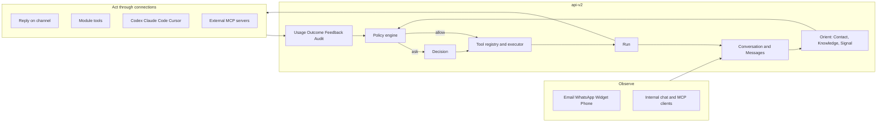

# Bokito Core Intent

Canonical product north star for humans and coding agents. Use this document to judge whether a feature belongs in the architecture before implementation.

This is the **V2** intent. V2 lives in `apps/api-v2` and `apps/web-v2`. V1 (`apps/api`, `apps/dashboard`, `apps/mobile`) is legacy: it keeps running for existing tenants and receives fixes only. See [`adr/002-v2-coexistence.md`](adr/002-v2-coexistence.md).

**Related:** strategy and market evidence in [`STRATEGY_2026-09.md`](STRATEGY_2026-09.md); positioning in [`POSITIONING.md`](POSITIONING.md); living operational facts in [`BOKITO_KNOWLEDGE.md`](../BOKITO_KNOWLEDGE.md).

---

## 1. North star

**Drive the company from the conversation.**

Bokito is the shared conversation of a company. Customers and partners keep writing where they already write (email, WhatsApp, the web widget, a phone line); the company reads and answers all of it in one list, next to its colleagues and its AI agents. Nobody outside is asked to log in anywhere. Everything that runs in the background is started, watched, and changed from those conversations.

Bokito does not replace ChatGPT, Claude, Copilot, Codex or Cursor. It is the layer on top: the place where a company decides what those tools may do, hands them work that came out of a conversation, and sees the result next to the message that caused it. Those tools operate the Bokito workspace through MCP under the same policy as internal agents.

Long-term aim: an operational **digital twin** the business runs on, observes through Overview and Govern, and improves through feedback.

## 2. One mental model: the OODA loop

Every feature is a step in one loop. If a feature is not one of these steps, it does not belong in the core.

| Step | Meaning in Bokito | Objects |
|------|-------------------|---------|
| **Observe** | Everything that enters becomes a message in a conversation, whatever the channel | `Conversation`, `Message`, `Connection` |
| **Orient** | The system reads first: who is this, what do we know, what kind of thing is this | `Contact`, `Organization`, `Doc`, `Signal` (typed recognition) |
| **Decide** | Policy decides whether an action runs, asks, or is denied; asking is a Decision card in the thread | `Policy`, `Decision` |
| **Act** | One executor runs every tool for every caller; every run is a record | `Agent`, `Playbook`, `Run`, `Trigger` |
| **Feedback** | Usage, outcomes and corrections feed back into policy, metrics and memory | `UsageEvent`, `Outcome`, `Feedback`, `AuditEvent`, `Change` |

## 3. Decision rules

1. **Everything is reachable from a conversation.** Pages browse; every mutation is a tool that agents, MCP clients, REST and the command palette call through the same executor. A page action without a tool is unfinished.
2. **Five operator nouns.** Conversation (Gesprek), Contact (with its Organization), Agent, Playbook (Draaiboek), Decision (Beslissing). Signal (Signaal) is a typed label on a Conversation, shown as a chip and a filter, never a hub. Plumbing (Connection, Run, Trigger, Message, Policy) never appears as a noun in the UI.
3. **Modules add types, playbooks and tools. Never screens, never nouns.** Accounting adds signal types, a playbook and Moneybird tools. Verticals (installers, accountancy, property) are modules.
4. **The system reads first, people correct.** Every inbound is oriented (contact, signal type, summary). Manual actions fix a miss.
5. **Autonomy is one dial in one place.** The workspace posture (manual, assisted, autonomous) is the ceiling in Govern; a signal type, playbook or agent may sit below it. Consequential tools always ask until an owner lowers that per tool.
6. **The thread is the log.** What an agent did on a conversation appears in that conversation as a message. Govern keeps the full audit; nobody has to go there to know what happened.
7. **Ask inline, record in Govern.** A human gate is a Decision card in the thread with one resolve path. Govern is the ledger, not a second inbox.
8. **One ledger, one connection, one decision.** `runs` is the only work record. `connections` is the only external attachment (channel, integration, MCP server, model provider, workbench). `decisions` has one resolve endpoint.
9. **Hand work to the tools people already use.** Code goes to Codex, Claude Code or Cursor through a workbench connection. Bokito decides, dispatches, gates and reports. It never hosts an IDE, a repo browser, or a diff viewer.
10. **EU by default, open by choice.** Data at rest in the EU. The managed model runs in an EU region. Bring-your-own-key to any provider is allowed and shown. Every channel discloses that an AI is answering (EU AI Act Article 50) unless an owner switches that off per connection.
11. **Count what the customer pays for.** Resolved conversations, time saved and channel costs are first-class numbers, computed deterministically and visible per conversation and on Overview.
12. **Delete the old surface in the same change.** No compatibility twins inside V2.

## 4. Operator vocabulary

| EN | NL | Table |
|----|----|-------|
| Conversation | Gesprek | `conversations` |
| Signal | Signaal | `signals` (typed recognition on a conversation) |
| Playbook | Draaiboek | `playbooks` |
| Contact / Organization | Contact / Organisatie | `contacts`, `organizations` |
| Agent | Agent | `agents` |
| Decision | Beslissing | `decisions` |

Overview, Govern, Work, Knowledge, Connections and Settings are the surfaces. Communication / Communicatie is the conversation surface. Overview, Govern and Agents stay English loanwords in Dutch.

Do not add Task or Project as operator nouns. A "look again later" is `Conversation.follow_up_at`; typed work is a Signal; grouping is tags.

## 5. Architecture (V2)

```mermaid
flowchart LR
  subgraph observe [Observe]
    Channels[Email WhatsApp Widget Phone]
    Internal[Internal chat and MCP clients]
  end
  subgraph core [api-v2]
    Conv[Conversation and Messages]
    Orient[Orient: Contact, Knowledge, Signal]
    Policy[Policy engine]
    Decision[Decision]
    Exec[Tool registry and executor]
    Run[Run]
    Feedback[Usage Outcome Feedback Audit]
  end
  subgraph act [Act through connections]
    Reply[Reply on channel]
    Modules[Module tools]
    Workbench[Codex Claude Code Cursor]
    Mcp[External MCP servers]
  end
  observe --> Conv --> Orient --> Policy
  Policy -->|ask| Decision --> Exec
  Policy -->|allow| Exec --> Run --> act
  Run --> Conv
  act --> Feedback --> Policy
```

### Repo anchors

| Surface | Location | Role |
|---------|----------|------|
| **Backend** | `apps/api-v2` (FastAPI, package `bokito`) | Domain, tools, agent loop, channels, gateway, MCP |
| **Web** | `apps/web-v2` (Vite + React + TS) | Communication, Overview, Govern, Work, Knowledge, Connections, Settings |
| **Widget** | `apps/chat-widget` | Customer-facing embed, built against `/api/livechat` of api-v2 |
| **Shared** | `packages/shared` | Types and helpers shared by web and widget |
| **Legacy** | `apps/api`, `apps/dashboard`, `apps/mobile` | V1, frozen |

### Domain layout in `apps/api-v2/bokito`

- `domain/` one module per aggregate: `identity`, `conversation`, `orient`, `work`, `connection`, `govern`, `metering`
- `tools/` registry, policy, executor, and one module of tools per domain
- `agent/` loop, providers, model resolution
- `channels/` email, whatsapp, widget, phone (interface), outbound
- `realtime/` gateway (one WebSocket)
- `api/` thin routers that call tools or read models
- `workers/` ARQ jobs
- `modules/` module spec and module packages

## 6. Design constraints

- **Postgres as Postgres.** Native enums or CHECK constraints, JSONB, pgvector, unique constraints on hot paths, one Alembic baseline. Tests run on Postgres.
- **Small files.** No module above roughly 500 lines. Tools per domain; services per aggregate.
- **Strict tenant isolation.** `tenant_id` on every domain row; every query filters it.
- **Minimalist UI.** Calm and obvious. Shared primitives, design tokens, no emoji in copy, one title per screen.
- **Alignment test.** Can this be expressed as a step in the OODA loop with an optional Decision? If not, redesign.

## 7. Pre-flight checklist (state before coding)

1. **Step** — Observe, Orient, Decide, Act or Feedback?
2. **Nouns** — Which of the five nouns (or which plumbing object)? Is a new type justified?
3. **Tool** — Which tool does this mutation run through? Trust levels: operator, agent, api, external.
4. **Gate** — none, Decision card, Change draft, or manual only?
5. **Posture** — Does it respect the workspace posture and per-tool overrides?
6. **Feedback** — Which usage, outcome or audit record does it write?
7. **Surface** — Communication, Overview, Govern, Work, Knowledge, Connections or Settings? Never a new hub.
8. **EU** — Does data stay in region? Does the channel disclose AI?
9. **Docs** — Do operators or integrators see something different? Update `docs/product-help/` EN and NL, run `sync_product_help.py`. Internal facts go to `BOKITO_KNOWLEDGE.md`.

## 8. Anti-patterns

- A second inbox, decision list, work ledger or connection table
- Rail items per loop step, or a Decisions or Tasks tab
- Agent writes that bypass the executor, policy or audit
- Results with no usage, outcome or audit record
- Hardcoded API paths outside `apps/web-v2/src/api/routes/`
- Rebuilding coding tools inside Bokito
- Importing V1 code into V2; port by copying and simplifying

## 9. Further reading

| Document | Purpose |
|----------|---------|
| [`STRATEGY_2026-09.md`](STRATEGY_2026-09.md) | Market evidence, ranked directions, pricing hypothesis |
| [`POSITIONING.md`](POSITIONING.md) | Category, ICP, competitors, land-and-expand |
| [`adr/002-v2-coexistence.md`](adr/002-v2-coexistence.md) | V2 next to V1: repo, database, deploy |
| [`architecture.md`](architecture.md) | V1 (legacy) stack map |
| [`BOKITO_KNOWLEDGE.md`](../BOKITO_KNOWLEDGE.md) | Living product knowledge |
