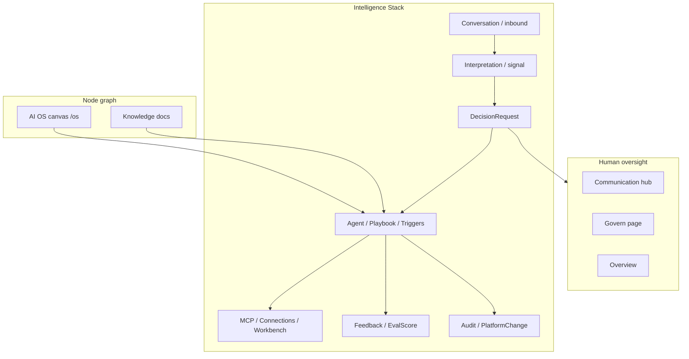

# Bokito Core Intent

Canonical product north star for humans and coding agents. Use this document to judge whether a feature belongs in the architecture before implementation.

**Related:** technical stack map in [`architecture.md`](architecture.md); living operational facts in [`BOKITO_KNOWLEDGE.md`](../BOKITO_KNOWLEDGE.md).

---

## 1. North star — why we exist

**Drive the company from the conversation.**

Bokito is one chat surface for the company. Clients and partners keep writing where they already write (email, WhatsApp, the web widget, a phone line); the company reads and answers all of it in one list, next to its colleagues and its AI agents. Nobody outside is asked to log in anywhere. Everything that runs in the background is started, watched, and changed from those conversations. Chat is the control plane because everyone already knows how to chat.

Bokito does not replace ChatGPT, Claude, Copilot, or Cursor, and it does not try to become a coding agent. It is the layer on top: the place where a company decides what those tools are allowed to do, hands them work that came out of a conversation, and sees the result next to the customer message that caused it. People already build in Cursor, Claude, and ChatGPT; Bokito connects to those environments and drives them, so a bug report that arrives on WhatsApp can become a pull request in the tool the team already uses, under the same posture as everything else. Even the platform changes itself through chat: an agent proposes a change, a person approves it inline, Govern records it.

Traditional companies coordinate through human layers: managers route work, inboxes fragment attention, and software mirrors org charts. Bokito unifies customer signals, agent orchestration, and human judgment in one operational flow — with **governed autonomy** tenants can dial from manual oversight toward *AI runs operations, humans at the exception layer*.

Long-term aim: an operational **digital twin** the business can run on, observe through Cockpit and Govern, and **improve through feedback** — not a collection of one-off automations that never learn or explain themselves.

**Market positioning detail:** [`POSITIONING.md`](POSITIONING.md).

### Decision rules

Apply these to every feature request.

1. **Everything is reachable from a conversation.** Pages stay for browsing and for tools people use side by side with chat (a calendar, a list of agents). But nothing may exist only on a page: every agent, playbook, project, contact, and setting must also open from the thread that needs it, and every action a page offers must have a chat path.
2. **One object per idea.** Operators name seven things: Conversation, Signal, Playbook, Project, Contact (with its Organization), Agent, Decision. Plumbing behind them (Connection, Trigger, WorkJob, Message) never appears as a noun in the UI. A new operator-facing noun needs a reason the seven cannot give.
3. **Modules add types and playbooks. They never add screens.** Installing accounting adds signal types, a playbook, and tools. It does not add a rail item, a queue, or a settings page.
4. **The system reads first, people correct.** Every message is interpreted. Manual actions exist to fix a miss, not as the normal path.
5. **Autonomy is one dial in one place.** Govern owns manual / assisted / autonomous as the workspace ceiling; a signal type or playbook may sit below it, also in Govern. No per-project, per-channel, or per-page copy of it.
6. **The thread is the log.** What an agent did on a conversation appears in that conversation as a message. Govern keeps the full trace; nobody has to go there to know what happened.
7. **Ask inline, record in Govern.** A human gate is a decision card in the thread. Govern is the ledger, not a second inbox.
8. **Delete the old surface in the same change.** No compatibility twin.
9. **Hand work to the tools people already use; do not rebuild them.** Code goes to Cursor, Claude, or ChatGPT environments through a connection. Bokito decides, dispatches, gates, and reports. It never hosts an IDE, a repo browser, or a diff viewer of its own.

### Operator vocabulary (Set C)

| EN | NL | Role | Table (internal) |
|----|----|------|------------------|
| Conversation | Gesprek | The chat | `signals` |
| Signal | Signaal | What the system recognized | `cases` |
| Playbook | Draaiboek | What runs | `workstreams` |
| Project | Project | Optional home for that work | `projects` |
| Contact | Contact | Person you are talking to | `contacts` |
| Agent | Agent | AI or company agent | `agents` |
| Decision | Beslissing | Question in the thread | `decision_requests` |

Do **not** add Task as an eighth operator noun. A free "look again later" is a dated next look-at on the Conversation (`Signal.follow_up_at`); typed work is a Signal (Case). Snooze parks the conversation; a look-at stays visible. `AgentTask` remains internal ledger plumbing.

Overview, Govern, and Agents stay English loanwords in the Dutch UI. Communication / Communicatie is the rail hub name (not Messages / Berichten).

---

## 2. What we are building (in this repo)

A **flexible, node-based agentic OS** that lets SMBs and their operators create and run AI-driven businesses. Every meaningful component is a **node** in a composable graph — agents, playbooks, conversations, signals, integrations, knowledge, canvas layout — so both humans and agents can read, generate, and reshape the system within one semantic model.

```mermaid
flowchart TB
  subgraph human [Human oversight]
    Communication[Communication hub]
    Govern[Govern page]
    Overview[Overview]
  end
  subgraph stack [Intelligence Stack]
    Sensing[Conversation / inbound]
    Interpret[Interpretation / signal]
    Decide[DecisionRequest]
    Orchestrate[Agent / Playbook / Triggers]
    Integrate[MCP / Connections / Workbench]
    Learn[Feedback / EvalScore]
    Assure[Audit / PlatformChange]
  end
  subgraph graph [Node graph]
    Canvas[AI OS canvas /os]
    Knowledge[Knowledge docs]
  end
  Sensing --> Interpret --> Decide --> Orchestrate
  Orchestrate --> Integrate
  Orchestrate --> Learn
  Decide --> human
  Orchestrate --> Assure
  Canvas --> Orchestrate
  Knowledge --> Orchestrate
```

### Repo anchors (V1 bokito track)

| Surface | Location | Role |
|---------|----------|------|
| **Backend** | `apps/api` (FastAPI) | Intelligence Stack APIs, agent loop, govern, signals |
| **Portal** | `apps/dashboard` (`VITE_API_MODE=bokito`) | Overview, Communication hub, AI OS canvas, Govern, settings |
| **OS canvas** | `/os`, `os_canvas_nodes` / `os_canvas_edges` | Visual graph; domain entities stay in real tables |
| **Unified sensing** | `Signal`, `SignalMessage` | One thread model for external (email, chat, widget) and internal (agent) communication |
| **Communication hub** | `/support/inbox/*`, `/messages` | Single UI for human + agent threads; decisions inline in timeline |
| **Human gates** | `DecisionRequest`, Govern draft queue | Inline approve/defer/reject in threads; structural changes via `PlatformChange` |
| **Self-maintenance** | Agent tools → `propose_platform_change()` | Agents propose graph/agent/integration edits under apply modes and audit |
| **V1 track** | FastAPI `apps/api` | All bokito-mode features use FastAPI + Signal; no parallel legacy stacks |

Intelligence Stack layers are **conceptual lanes** on the canvas and in metrics — not separate top-level navigation tabs. See [`architecture.md`](architecture.md) for the layer-to-code mapping.

---

## 3. Architectural principles

### Node-first

Everything important should map to a **small set of canonical entity types**. Prefer extending:

- `Signal` / `SignalMessage` — conversation context (external and internal)
- `Case` / `CaseType` — product signal (typed recognition on a conversation); operator word **Signal**
- `ChannelAccount` — one entity for every channel (mailbox, Bokito relay address, website chat, WhatsApp, Slack); lifecycle **state**, **capabilities** and **checks** are derived per kind in `services/channel_registry.py`
- `Agent`, `Workstream` (operator: Playbook), `AgentRun` — orchestration
- `DecisionRequest` — human action objects **within** threads, not parallel list UIs
- `WorkspaceDoc`, `DocChunk` — workspace knowledge
- `Project` — container of signals and conversations; optional workbench connection for coding tools
- `os_canvas_nodes` / `os_canvas_edges` — visual graph overlay
- `PlatformChange`, `AuditEvent` — governable mutations

Resist inventing a second inbox, a second decision list, or a second graph when the existing node already expresses the concept.

### Intelligence flow

Features should declare which **stack stage(s)** they serve and what they hand off to next:

| Stage | Question to answer |
|-------|-------------------|
| **Sensing** | What entered the system? From which channel? |
| **Interpretation** | What signal type(s) does it match? |
| **Decision** | Does a human need to choose before action? |
| **Orchestration** | Which agent/playbook executes? |
| **Integration** | Which external tool, workbench, or connection is involved? |
| **Learning** | What outcome can feed back into policy or eval? |
| **Govern & assure** | Is the change scoped, audited, reversible? |

Isolated CRUD screens that do not connect to this loop are incomplete by design.

### Learning by default

When an action produces an outcome users care about, capture something for later improvement:

- User feedback on agent output (`Feedback`)
- Corrections on signals (confirm, dismiss, wrong-type) as few-shot examples
- Autonomy / escalation metrics (`EvalScore`, Overview)
- Policy tightening via Govern dials

V1 uses **heuristics**, not ML fine-tuning — but the **hook must exist**. A feature that never records success, failure, or human override is unfinished.

### Govern and assure

Agent autonomy is only valuable if it stays **trustworthy**:

- **Autonomy posture** (tenant preset): `manual` | `assisted` | `autonomous` — workspace ceiling; a signal type or playbook may sit below it
- **Permissions** per agent (tool allowlist)
- **Apply modes** per resource type: `draft`, `yolo`, or `decision`
- **Trace** via `AuditEvent` and the Govern Ledger
- **Reversibility** via `PlatformChange` rollback (30-day window where supported)
- **Human path** for exceptions — never silent structural writes from agents
- **Consequential tools** (money, contracts, merge PR) always ask until an Owner lowers that per tool

Structural mutations flow: scope check → propose → (draft queue | yolo | decision) → apply → audit.

### Human at the exception layer

Automate the routine. Surface ambiguity **in context**:

- Confirm chips and decision cards on the thread timeline
- Review platform drafts on `/govern`
- Escalate only what policy cannot resolve

Avoid burying attention items in duplicate admin lists or disconnected pages.

---

## 4. Build phase

The product is in the **initial building phase**. Prefer the cleanest design that fits the node model and north star over backward-compatibility shims. Breaking changes to frontend, backend, and database schema are acceptable when they reduce duplicate mental models or parallel stacks. Do not add migration layers or dual APIs unless explicitly requested.

---

## 5. Design constraints

### Simplicity

Prefer the **simplest design** that fits the node model. If a feature needs a second mental model for users or a parallel schema for agents, reconsider before building.

**Example (wrong direction):** separate Cases hub and Decisions tab for the same conversation context. **Right direction:** Communication hub with signal labels on rows and inline decision cards.

### Minimalist UI

The interface should make a complex system feel **calm and obvious**:

- Shared layout primitives (`PageContent`, `EmptyState`, `AppHeader`)
- Design tokens in `apps/dashboard/src/index.css`
- No emoji in UI copy (workspace policy)
- One title per screen; bespoke flows (inbox 3-pane) stay intentional

### Scalability

Every choice should hold as tenants, agents, nodes, and messages grow:

- Strict **tenant isolation** (`tenant_id` on all domain rows)
- Composable graph instead of hard-coded product modules
- Server-side views/queues rather than client-only filtering at scale

### Alignment test

Before building, ask: *Can this feature be expressed as nodes within the intelligence flow, with an optional human gate?*

If not, **pause and redesign** — or explicitly document why the exception is temporary.

---

## 6. Agent pre-flight checklist

Before implementing a feature, state (even briefly):

1. **Layer** — Which Intelligence Stack stage(s)? (Sensing / Interpretation / Orchestration / Integration / Learning / Govern)
2. **Nodes** — Which entity types are created, read, or updated? Is any **new** type justified?
3. **Flow** — What triggers this, and what happens next in the loop?
4. **Human gate** — `none` | `inline decision` | `Govern draft` | `manual-only`
5. **Autonomy posture** — Does this respect tenant posture and apply modes?
6. **Learning hook** — What outcome is captured for later improvement?
7. **Trust** — Permissions, audit event, rollback path if agents mutate structure
8. **UI surface** — Which existing hub? (Communication, `/os`, `/govern`, Overview, settings) — avoid a fourth comms or agent entry point
9. **Docs** — Do operators or integrators see or do something different? If yes: look up `docs/product-help/surface-map.yaml`, update the matching `en/` and `nl/` articles, recapture screenshots when that use-case UI changed, run `python apps/api/scripts/dev/sync_product_help.py`. Internal facts go to `BOKITO_KNOWLEDGE.md`.

When you learn new product facts during implementation, log them in [`BOKITO_KNOWLEDGE.md`](../BOKITO_KNOWLEDGE.md) (see `.cursor/rules/bokito-platform-knowledge.mdc`).

---

## 7. Anti-patterns (repo-learned)

Do **not**:

- Add parallel inbox / decision / message APIs for the same user mental model
- Add new top-level rail items per Intelligence Stack layer
- Let agent writes bypass `propose_platform_change()` or tenant apply modes
- Ship features that produce results but never feed Learning or Govern
- Hardcode dashboard API paths outside `apps/dashboard/src/api/routes/`
- Introduce emoji in UI text, labels, or logs
- Rebuild coding tools (IDE, repo browser, diff viewer) inside Bokito — connect via workbench instead
- Duplicate operational documentation here — use `BOKITO_KNOWLEDGE.md` for facts, this doc for **intent**

---

## 8. Further reading

| Document | Purpose |
|----------|---------|
| [`POSITIONING.md`](POSITIONING.md) | Category, ICP, competitors, land-and-expand |
| [`architecture.md`](architecture.md) | Intelligence Stack → code mapping, govern lifecycle, API groups |
| [`BOKITO_KNOWLEDGE.md`](../BOKITO_KNOWLEDGE.md) | Living product knowledge (features, flows, SOPs) |
| [`apps/dashboard/docs/API.md`](../apps/dashboard/docs/API.md) | Frontend API route pattern |
| [`apps/dashboard/docs/NAVIGATION.md`](../apps/dashboard/docs/NAVIGATION.md) | Portal IA and redirects |
| [`docs/company/README.md`](company/README.md) | English company handbook index |
