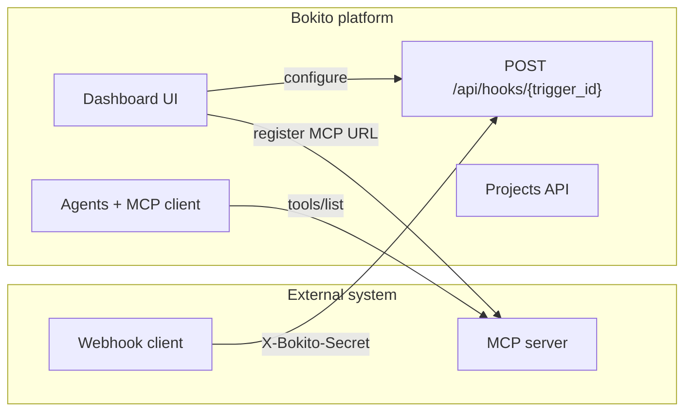

# External integrations pattern

How to connect an **external system** (separate repo, VPS sidecar, or SaaS) to Bokito using generic platform primitives — no trading-specific code in FastAPI routers.

## Architecture



## Setup checklist (dashboard)

Use [/integrations/setup](https://app.bokito.ai/integrations/setup) or follow these steps:

1. **Agent** — Create a worker agent at `/agents` with instructions for your domain.
2. **MCP** — Register a custom MCP server at `/settings/mcp`. The URL must be reachable from the **Bokito API container** (Docker internal hostnames are fine; browser reachability is not required). Use **Test connection** to list tools.
3. **Webhook** — Create a webhook trigger on `/agenda` (Automations). Copy hook URL, trigger ID, and secret from the webhook panel. Use **Rotate secret** if needed; **Test ping** verifies delivery.
4. **Project** — Create a project at `/settings/projects` and link or create an orchestrator agent.
5. **Thread** — Open an internal thread and assign it to the project (agent context panel).
6. **External env** — Paste credentials into your external system's environment (see below).

## Credentials mapping

| Bokito UI | External `.env` |
|-----------|-----------------|
| Hook URL (`/api/hooks/{id}`) | `BOKITO_HOOK_URL` |
| Trigger ID | `BOKITO_TRIGGER_ID` |
| Webhook secret (one-time on create/rotate) | `BOKITO_WEBHOOK_SECRET` |
| Workspace origin | `BOKITO_BASE_URL` (use `http://bokito-api:8000` on shared Docker network, not host loopback) |
| Tenant slug | `BOKITO_TENANT_SLUG` |
| MCP server URL (internal Docker) | Configure in trading/sidecar stack separately |

Webhook authentication: header `X-Bokito-Secret: <secret>` or query `?secret=<secret>`.

### Trading report payloads (optional)

The external trading stack may POST structured outcomes:

```json
{
  "kind": "report",
  "subtype": "trade_closed|session_summary|setup_skipped|error",
  "setup_id": "...",
  "pnl_r": 1.2,
  "notes": "..."
}
```

Bokito persists these as tenant-scoped `OperationalOutcome` rows, maps PnL to Learning `Feedback`, and surfaces agent summaries in Messages (tenant setting `operations_signal_id`).

**Fallback without trading-repo changes:** seed a cron trigger (for example `Trading session digest`) that polls MCP tools (`get_positions`, `risk_status`, `list_setups`) and always posts a summary. Autotrading bootstrap creates this at `0 16 * * *` UTC.

## Docker sidecar network

For MCP and webhook bridges on the same VPS as Bokito:

- Compose stack uses external network `bokito_shared`.
- Bokito `api` service has alias `bokito-api` on that network.
- External MCP containers join `bokito_shared` with a stable hostname (for example `trading-exec-mcp`).

After `docker compose recreate`, reconnect external stacks to `bokito_shared` if needed.

## API endpoints (generic)

| Endpoint | Purpose |
|----------|---------|
| `POST /api/triggers` (kind=webhook) | Create webhook; secret returned once |
| `POST /api/triggers/{id}/rotate-webhook-secret` | Rotate secret (admin) |
| `POST /api/triggers/{id}/test-webhook` | Server-side test ping (admin) |
| `POST /api/hooks/{id}` | Public webhook ingress |
| `POST /api/integrations/mcp/install` | Register MCP server |
| `POST /api/integrations/mcp/{server_id}/test` | Test MCP tools/list |
| `PATCH /api/signals/{id}` (`project_id`) | Link thread to project |
| `/api/workforce/projects` | Project CRUD + PO agent link |

## Ops-only tenant bootstrap

Tenant-specific bootstrap scripts live under `apps/api/scripts/tenants/<tenant>/` and are **not** imported by runtime services. VPS ops helpers are under `scripts/ops/tenants/<tenant>/`.

For new integrations, prefer dashboard self-service over bootstrap scripts.

## Related docs

- Dashboard integrations guide: [apps/dashboard/docs/INTEGRATIONS.md](../apps/dashboard/docs/INTEGRATIONS.md)
- API routes pattern: [apps/dashboard/docs/API.md](../apps/dashboard/docs/API.md)
