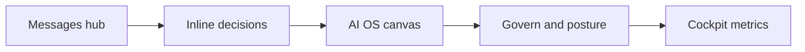

# Bokito Positioning

Canonical market framing for product, sales, and engineering alignment. Technical north star: [`CORE_INTENT.md`](CORE_INTENT.md).

Last updated: June 2026

---

## Category and one-liner

**Category:** Unified operational flow for AI-driven SMBs — inbox, agents, and approvals in one governed system.

**One-liner:** *The inbox, the agents, and the approvals — finally in one system.*

**Trust dial:** Tenants choose an **Autonomy Posture** (Manual / Assisted / Autonomous) to move from full human oversight toward *AI runs operations, humans at the exception layer*.

---

## Three differentiators

| Differentiator | What it means | Product proof |
|----------------|---------------|---------------|
| **One thread model** | External customer comms and internal agent work share `Signal` / `SignalMessage` | Messages hub (`/messages`, `/support/inbox/*`) |
| **Inline human gates** | Approve, defer, or reject in the thread timeline — not a separate approvals app | `DecisionRequest` as `SignalMessage.kind=decision_request` |
| **Governed self-maintenance** | Agents propose structural changes; humans review via Govern; audit and rollback | `PlatformChange`, Autonomy Posture, `/govern` |

---

## Ideal customer profile (wedge ICP)

- **Size:** 15–150 employees
- **Buyer:** Ops lead, founder, or accidental COO
- **Pain:** Email, Slack, and CRM fragment attention; managers still route work; automations do not learn or explain themselves
- **Trigger:** Tried Zapier/Make or a chatbot; needs one place for signals, agents, and exceptions

**Anti-ICP (for now):** Pure dev teams (n8n), CRM-only sales orgs (Agentforce), chat-only support (Intercom).

---

## Land and expand

1. **Land:** Messages — familiar inbox for external and internal threads
2. **Expand:** Inline decision cards build trust
3. **Expand:** AI OS canvas — live map of how intelligence flows
4. **Expand:** Govern — posture presets and structural change review
5. **Expand:** Cockpit — time saved, escalation rate, learning loop

Do not lead sales or onboarding with the canvas alone. Lead with Messages.

---

## What we are not

- Not a personal AI executive assistant (Lindy)
- Not a GTM-only agent team builder (Relevance AI)
- Not a developer workflow canvas (n8n)
- Not a shared inbox with AI bolted on (Front)
- Not a chat-first support bot (Intercom Fin)
- Not a generic "AI OS" without unified ops flow (Beam, OrchStack — adjacent, not identical)

---

## Competitive landscape

| Competitor | How their environment is shaped | Bokito contrast |
|------------|--------------------------------|-----------------|
| **OrchStack** | Visual builder + runtime + 5-tier memory + outcome dashboards | Similar OS ambition; Bokito leads with unified Messages + inline decisions |
| **Beam AI** | SOP upload → graph-based agents; enterprise inbox for HITL | Similar govern story; Bokito is SMB-first with Signal-first wedge |
| **Relevance AI** | Workforce canvas; multi-agent GTM playbooks | Strong orchestration; no unified external/internal inbox |
| **Lindy** | Visual flows + personal assistant across apps | Individual productivity; not company-wide governed ops |
| **Vezra** | Pre-shaped departmental AI workers | Fast setup; less graph, less structural govern |
| **Salesforce Agentforce** | CRM-centric agents; Atlas reasoning; Command Center | Enterprise CRM lock-in; not SMB unified ops |
| **Microsoft Copilot Studio** | M365 agents; generative orchestration | Ecosystem-bound; not standalone ops core |
| **n8n** | LangChain workflow canvas; self-host | Developer audience; no Messages hub or Govern posture |
| **Front** | Collaborative shared inbox; AI assist | Human-first inbox; no agent OS or self-maintenance |
| **Intercom (+ Fin)** | Chat-first; AI deflection per resolution | Customer-facing only; not internal orchestration |

---

## Messaging hierarchy (website, portal, sales)

1. **Headline:** Unified ops flow outcome
2. **Subhead:** Governed autonomy — dial trust from Manual to Autonomous
3. **Three pillars:** One thread · Inline decisions · Governed changes
4. **Proof:** Single-loop demo (signal → triage → decision → agent → govern → cockpit)
5. **Compare:** Not a chatbot. Not Zapier++. Not a black-box agent workforce.

---

## Related docs

| Document | Purpose |
|----------|---------|
| [`CORE_INTENT.md`](CORE_INTENT.md) | Engineering north star and checklist |
| [`architecture.md`](architecture.md) | Intelligence Stack → code mapping |
| [`company/README.md`](company/README.md) | Company handbook index |
| [`BOKITO_KNOWLEDGE.md`](../BOKITO_KNOWLEDGE.md) | Living operational facts |
