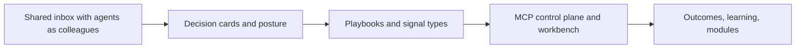

# Bokito Positioning

Canonical market framing for product, sales, and engineering alignment. Technical north star: [`CORE_INTENT.md`](CORE_INTENT.md). Strategy and evidence: [`STRATEGY_2026-09.md`](STRATEGY_2026-09.md).

Last updated: September 2026 (V2).

---

## Category and one-liner

**Category:** The governed conversation layer for companies run with AI.

**One-liner:** *Your company's shared conversation. Customers, colleagues and AI agents in one list; agents do the work, you decide what matters; EU-hosted, governed from one dial.*

**Trust dial:** Every workspace has an **Autonomy Posture** (Manual / Assisted / Autonomous). Agents propose; the posture decides whether a person is asked. Consequential tools (money, contracts, merges) always ask until an owner lowers that per tool.

---

## Three differentiators

| Differentiator | What it means | Product proof |
|----------------|---------------|---------------|
| **Shared and external** | Email, WhatsApp, widget and phone land in one list next to colleagues and agents; nobody outside logs in anywhere | Communication: one conversation list, one thread model for external and internal |
| **Decide in the thread** | Agents propose; a Decision card in the thread approves, rejects or defers; policy handles the routine | `Decision` as a message kind, one resolve path, autonomy posture |
| **Governed control plane** | ChatGPT, Claude, Copilot and coding agents operate the workspace through MCP under the same policy; every action is audited and reversible | `/api/mcp`, tool registry, `policies`, `changes` with rollback, `audit_events` |

Supporting: EU hosting with an EU-default model and BYOK; Article 50 disclosure per channel; resolved conversations, time saved and channel costs as visible numbers.

---

## Ideal customer profile

Segment by way of working, not by sector.

- **Size:** 2 to 50 people
- **Shape:** customer contact and work run through conversations (services, agencies, advisory, e-commerce, software)
- **Already:** uses two or more AI tools (ChatGPT, Claude, Cursor, Copilot) and has two or more external channels (email plus WhatsApp or widget)
- **Wants:** to stay in the EU, to know what agents did, to keep customers on the channel they already use
- **Buyer:** founder, ops lead, or the person who owns the shared inbox

**Anti-ICP (for now):** enterprises with an IdP-centred governance stack (Agent 365, Frontier), pure developer teams (n8n), CRM-only sales orgs (Agentforce), high-volume B2C support with per-resolution contracts (Sierra, Decagon).

---

## Land and expand

```mermaid
flowchart LR
  Inbox[Shared inbox with agents as colleagues] --> Decisions[Decision cards and posture]
  Decisions --> Playbooks[Playbooks and signal types]
  Playbooks --> Control[MCP control plane and workbench]
  Control --> Twin[Outcomes, learning, modules]
```

1. **Land:** the shared inbox, a category buyers already budget for (Front, Trengo, Crisp). The difference is visible in week one: decision cards instead of bot replies, an autonomy dial, resolved and time-saved that add up.
2. **Expand:** playbooks and signal types turn recurring conversations into governed routines.
3. **Expand:** the MCP control plane lets the tools people already use operate the workspace; coding work goes to Codex, Claude Code or Cursor from a customer thread.
4. **Expand:** outcomes, learning and vertical modules (installers, accountancy, property) once tenants show a pattern.

Do not lead with agent building, a canvas, or governance alone. Lead with the conversation.

---

## Pricing hypothesis

Flat workspace fee (indicative EUR 49 / 149 / 399 per month) plus a fee per resolved conversation; channel fees (Meta per message) passed through and shown per thread. Resolved means closed without human handoff for 72 hours. Between Kantum ($39 to $249) and Trengo (EUR 299 to 499); matches the 82% of buyers who prefer hybrid pricing.

---

## What we are not

- Not a per-user assistant (ChatGPT Workspace Agents, Dots, Claude Cowork, Copilot)
- Not an agent-building canvas (OpenAI Agent Builder, retired; Relevance, Lindy, n8n)
- Not a one-database company OS that replaces your stack (Hulda, Swiftly)
- Not a shared inbox with AI bolted on (Front, Trengo)
- Not a per-resolution support bot inside a CRM (Fin in Salesforce, HubSpot Breeze, Zendesk)
- Not a coding agent; we dispatch to Codex, Claude Code and Cursor

---

## Competitive landscape

| Competitor | Shape | Bokito contrast |
|------------|-------|-----------------|
| **OpenAI Workspace Agents / Dots** | Shared agents on schedules, Slack, one mailbox; Dots only directed by the owner; not in the EEA | Company-wide, external channels, EU-hosted, posture with rollback |
| **Anthropic Cowork / Claude for Small Business** | Long-running tasks, 37 connectors, approve before send, per-seat | Shared customer conversation, not a personal desktop; MCP client of Bokito, not competitor |
| **Microsoft Agent 365 / Copilot Cowork** | Governance and agent identity for IdP-centric enterprises, $15 plus $30 plus E7 | Governance sized and priced for 2 to 50 people |
| **Meta Business Agent** | Free AI replies inside WhatsApp, per-message billing from 1 Oct 2026 | Governed thread across channels, cost shown per thread, actions in back-office systems |
| **Kantum** | Governed operator over channels, escalation by WhatsApp then phone, $39 to $249 | Same thesis; Bokito has production tenants, EU hosting, mature thread model, MCP control plane |
| **Hulda / Zebi / Crost / Swiftly** | AI-native company OS for solo founders, one database, early access | Orchestrates the existing stack instead of replacing it; shared with the outside world |
| **Front / Trengo / Crisp** | Shared inbox per seat, AI as add-on, Crisp EU-hosted | Agents as colleagues under a posture; tools-first so everything is reachable from chat and MCP |
| **Fin (Salesforce) / HubSpot Breeze / Zendesk** | Per-resolution support agents inside a CRM | Neutral layer, internal and external threads, coding dispatch, SMB price |
| **Avoca / Probook / EliseAI** | Vertical AI ops for US home services and property, "one thread, humans on exceptions" | Same thread thesis, horizontal core with verticals as modules, Benelux and EU |

---

## Messaging hierarchy (website, portal, sales)

1. **Headline:** Your company's shared conversation
2. **Subhead:** Agents do the work, you decide what matters
3. **Three pillars:** One list for every channel · Decide in the thread · Governed control plane
4. **Proof:** one loop demo (WhatsApp message → signal recognised → agent proposes → decision card → reply sent → outcome counted)
5. **Compare:** Not a chatbot. Not a per-user assistant. Not another CRM.

---

## Related docs

| Document | Purpose |
|----------|---------|
| [`STRATEGY_2026-09.md`](STRATEGY_2026-09.md) | Market evidence and ranked directions |
| [`CORE_INTENT.md`](CORE_INTENT.md) | Engineering north star and checklist |
| [`adr/002-v2-coexistence.md`](adr/002-v2-coexistence.md) | How V2 runs next to V1 |
| [`BOKITO_KNOWLEDGE.md`](../BOKITO_KNOWLEDGE.md) | Living operational facts |
