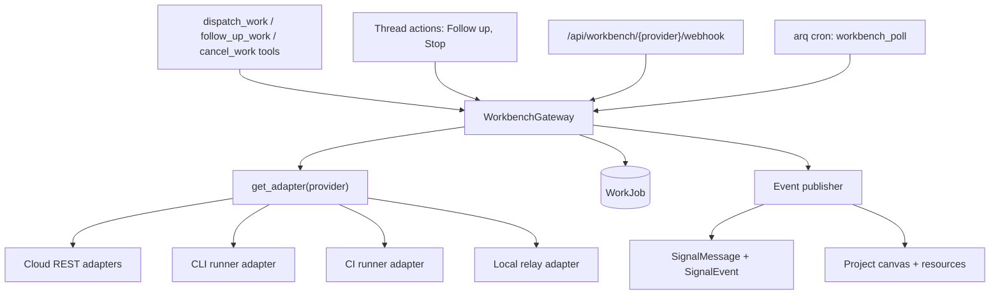
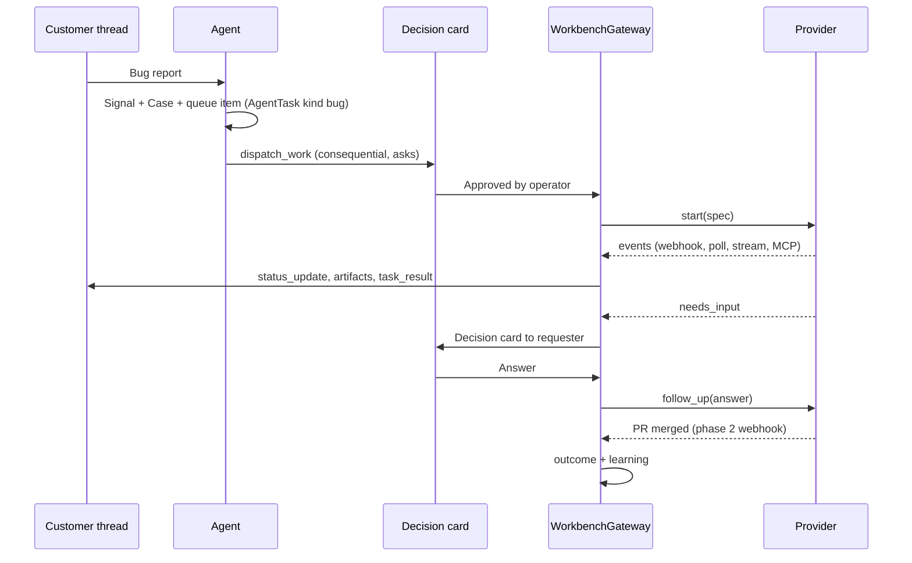

# Workbench gateway

Status: approved 2026-10-03. Phase 1 implemented: gateway, Cursor / Claude Managed Agents / Devin adapters, job tokens, poller, webhook router, Developers connect flow.

## Samenvatting (NL)

Bokito krijgt één **Workbench-gateway** waarmee een gesprek werk kan overdragen aan een externe AI-codingtool: starten, volgen, bijsturen en stoppen, met het resultaat (PR, branch, samenvatting) terug in hetzelfde gesprek en op het project. We bouwen op de bestaande Workbench-stub (`services/workbench`, `WorkJob`, `dispatch_work`); er komt geen tweede stack.

- **Vier soorten drivers:** cloud-API (Cursor, Claude Managed Agents, Devin, later Copilot), CLI in een runner (Claude Code, Codex, Aider), CI-runner in de GitHub Actions van de klant, en een lokale relay op de machine van de ontwikkelaar.
- **Eén grootboek:** `WorkJob` houdt de staat bij; elke gebeurtenis wordt een bericht in de thread. Een vraag van de tool wordt een beslissingskaart; het antwoord gaat als vervolgbericht terug.
- **MCP terug naar Bokito:** elke job krijgt een kortlevend token dat alleen een handvol tools mag (`report_progress`, `ask_question`, `attach_artifact` en wat leestools). Het token vervalt zodra de job klaar is.
- **Govern blijft de poort:** `dispatch_work` is consequential en vraagt dus altijd eerst. Verbinding, kosten en budget staan per job vast.
- **Fasering (besloten 2026-10-03):** fase 1 Cursor Cloud Agents, Claude Managed Agents en Devin (alle drie gehost, volledige API, niets zelf te draaien). Fase 2 een GitHub App met webhooks, Copilot cloud agent en Claude Code in de GitHub Actions van de klant. Fase 3 de lokale relay (ook Aider en JetBrains).
- **Codex en ChatGPT:** Codex cloud heeft geen publieke API. Codex wacht tot OpenAI die uitbrengt (besloten 2026-10-03). ChatGPT en de Codex CLI zijn alleen inkomend: ze roepen Bokito aan via MCP.
- **Open vragen** staan in sectie 9; de belangrijkste is waar CLI-tools draaien.

## Sources

Read on 2026-10-03. Most pages show no date; the version or date shown on the page is listed where there is one.

| Source | URL | Date or version shown |
|---|---|---|
| Cursor Cloud Agents API | https://cursor.com/docs/cloud-agent/api/endpoints | v1 public beta, no date |
| Cursor webhooks | https://cursor.com/docs/cloud-agent/api/webhooks | v1 "coming soon"; v0 documented |
| GitHub agent tasks REST | https://docs.github.com/en/rest/agent-tasks/agent-tasks?apiVersion=2026-03-10 | API version 2026-03-10, public preview |
| GitHub changelog, agent tasks via REST | https://github.blog/changelog/2026-05-13-start-copilot-cloud-agent-tasks-via-the-rest-api/ | 2026-05-13 |
| GitHub changelog, Pro plans | https://github.blog/changelog/2026-06-04-agent-tasks-rest-api-now-available-for-copilot-pro-pro-and-max/ | 2026-06-04 |
| Copilot agent MCP | https://docs.github.com/en/copilot/how-tos/use-copilot-agents/coding-agent/extend-coding-agent-with-mcp | no date |
| GitHub App installation tokens | https://docs.github.com/en/apps/creating-github-apps/authenticating-with-a-github-app/generating-an-installation-access-token-for-a-github-app | token format change from 2026-04-27 |
| GitHub webhook validation | https://docs.github.com/en/webhooks/using-webhooks/validating-webhook-deliveries | no date |
| Claude Managed Agents | https://platform.claude.com/docs/en/managed-agents/quickstart, https://platform.claude.com/docs/en/managed-agents/sessions | beta header `managed-agents-2026-04-01` |
| Claude Code routines API trigger | https://platform.claude.com/docs/en/api/claude-code/routines-fire | `anthropic-version: 2023-06-01` |
| Codex GitHub integration (`@codex`) | https://learn.chatgpt.com/docs/third-party/github | no date |
| Codex cloud scriptable lifecycle request | https://github.com/openai/codex/issues/24777 | open issue |
| Devin API v3 | https://docs.devin.ai/api-reference/overview | no date |
| Devin MCP | https://docs.devin.ai/work-with-devin/mcp.md | no date |
| Codex non-interactive | https://developers.openai.com/codex/noninteractive | no date |
| Codex MCP and SDK | https://developers.openai.com/codex/mcp, https://developers.openai.com/codex/sdk | no date |
| Claude Code headless | https://code.claude.com/docs/en/headless | mentions v2.1.286 behaviour |
| Claude Agent SDK | https://code.claude.com/docs/en/agent-sdk/overview | no date |
| Claude Code GitHub Actions | https://code.claude.com/docs/en/github-actions | no date |
| Aider scripting | https://aider.chat/docs/scripting.html | no date |
| VS Code MCP config | https://code.visualstudio.com/docs/copilot/reference/mcp-configuration | no date |
| JetBrains AI Assistant MCP | https://www.jetbrains.com/help/ai-assistant/mcp.html | no date |
| Windsurf MCP | https://docs.windsurf.com/windsurf/cascade/mcp | no date (Devin-branded) |
| ChatGPT developer mode | https://help.openai.com/en/articles/12584461 | no date |
| Claude remote connectors | https://claude.com/docs/connectors/custom/remote-mcp | no date |

Provider APIs in this space change monthly. Each adapter records the API version it was built against, and section 9 asks for a re-check before each phase starts.

## What exists today

The audit found a complete skeleton with no live behaviour:

- `services/workbench/__init__.py`: `JobSpec(repo_url, ref, brief, context_packet, options, images)`, `JobHandle(external_ids, provider)`, `NormalizedEvent(kind, summary, payload)`, `AdapterCapabilities` (ten booleans), and the `WorkbenchAdapter` protocol (`start`, `follow_up`, `status`, `cancel`, `handle_webhook`). `get_adapter(provider)` reads a registry.
- Stub adapters for `cursor`, `github_copilot`, `openai`, `anthropic` and `mcp`. Each `start` returns `{"status": "stub"}`.
- `models/workbench.py`: `WorkJob` with links to signal, case, project, connection and agent; `state` in `queued | running | needs_input | finished | failed | cancelled`; `external_ids_json`, `artifacts_json` (never written), `brief_json`, `cost_cents`.
- `dispatch_work` tool: consequential and gated, writes a `queued` stub job, and does not read the connection's credentials.
- `IntegrationConnection.kind` allows `workbench`, but no code writes it. `Project.workbench_connection_id` exists.
- GitHub is an OAuth App (`repo`, `read:user`, `user:email`) with repo indexing and `search_repo`. There are no webhooks, no PR calls and no GitHub App.
- MCP: Streamable HTTP at `/api/mcp`. Two token types: `bok_` app tokens (SHA-256 hashed, scoped by tool category) and OAuth `bok_oa_` (60 minutes, refresh 30 days). Scoping is per category only; there is no per-tool or per-job scope.
- No routers, no poller, no event-to-thread publisher, and no tests for any of it.

---

## 1. Minimum viable abstraction

### Term mapping

| Term from the brief | Bokito today | Change |
|---|---|---|
| AgentSessionConfig | `JobSpec` | Extend (below) |
| SessionLifecycle | `WorkbenchAdapter` | Add `poll` and `verify_webhook` |
| UnifiedStatus | `WORK_JOB_STATES` | Keep; add a per-provider mapping |
| UnifiedArtifact | `WorkJob.artifacts_json` entries | Define the shape (below) |
| Session event | `NormalizedEvent` | Keep; add `external_event_id` for idempotency |
| Provider account | `IntegrationConnection(kind="workbench")` | Start writing it |

### JobSpec additions

```python
@dataclass
class JobSpec:
    repo_url: str
    ref: str
    brief: str
    context_packet: dict            # thread excerpt, signal, case, project, acceptance criteria
    options: dict = {}
    images: list[dict] = []
    # new
    model: str | None = None        # provider model id, validated against the provider's list
    mode: str = "agent"             # agent | plan
    create_pr: bool = True
    env: dict[str, str] = {}        # non-secret variables, stored on the job
    secrets_ref: str | None = None  # pointer to an encrypted blob; never copied into brief_json or logs
    mcp: McpAttach | None = None    # how the tool reaches Bokito (section 5)
    budget: Budget | None = None

@dataclass
class McpAttach:
    url: str                        # https://<host>/api/mcp
    token: str                      # job token, only in memory while starting
    tools: list[str]                # allowlist the token carries

@dataclass
class Budget:
    max_minutes: int = 60
    max_cost_cents: int | None = None   # provider-native when supported (Devin max_acu_limit), else enforced by Bokito
```

`secrets_ref` resolves to `get_connection_credentials` on the workbench connection plus optional per-project secrets. The adapter receives the decrypted values only inside `start`.

### Artifact shape

Every entry in `artifacts_json`:

```json
{
  "type": "pr | diff | branch | log | summary | url",
  "url": "https://github.com/acme/app/pull/42",
  "ref": "cursor/fix-login",
  "title": "Fix login redirect",
  "state": "open | merged | closed | null",
  "external_id": "provider artifact id",
  "created_at": "2026-10-03T12:00:00Z"
}
```

Artifacts are append-only. A PR that changes state updates `state` on its entry and writes a thread event; it does not add a second entry.

### Status mapping

| Bokito | Cursor run | Claude Managed Agents session | Copilot task | Devin session | Codex / Claude Code CLI |
|---|---|---|---|---|---|
| queued | `CREATING` | created, sandbox provisioning | `queued` | `new`, `claimed` | process not started |
| running | `RUNNING` | `running` | `in_progress` | `running` + `working` | process running |
| needs_input | (none; see below) | `idle` with a question, or a tool confirmation | `waiting_for_user` | `running` + `waiting_for_user` / `waiting_for_approval` | `ask_question` over MCP |
| finished | `FINISHED` | `idle` with `end_turn` | `completed`, `idle` | `exit`, `running` + `finished` | exit 0 with a final message |
| failed | `ERROR`, `EXPIRED` | `terminated` with an error, budget reached | `failed`, `timed_out` | `error`, suspended for quota | non-zero exit, timeout |
| cancelled | `CANCELLED` | interrupted by Bokito, then archived | `cancelled` | suspended `user_request`, deleted | killed by Bokito |

Cursor and the CLIs have no native "needs input". There, `needs_input` happens only when the tool calls `ask_question` through Bokito's MCP (section 5). That makes the MCP attach a functional requirement, not a nice-to-have.

### WorkJob additions

| Column | Purpose |
|---|---|
| `external_id` (indexed, unique with `provider`) | Idempotency for webhooks and polls |
| `decision_id` | The approved Decision that started the job |
| `requested_by_user_id` | Who approved; gets the questions |
| `job_token_id` | The MCP token minted for this job |
| `last_event_at`, `last_polled_at` | Poller and stale detection |
| `outcome` | `merged | closed | abandoned | null`, set once (learning) |
| `budget_json` | Copy of the budget the job started with |

`brief_json` stays the full `JobSpec` minus `secrets_ref` values and the MCP token.

---

## 2. Pattern mapping per category

| | Cloud REST | Codex-style CLI / SDK | CI runner | Local relay |
|---|---|---|---|---|
| Providers | Cursor, Claude Managed Agents, Devin, Copilot, Codex cloud via `@codex` | Claude Code, Codex, Aider | `claude-code-action`, `codex-action` in the customer's repo | Any CLI or IDE on a developer machine |
| Authentication | Tenant API key (Cursor, Devin service user); per-user GitHub token (Copilot) | Model API key per tenant (`ANTHROPIC_API_KEY`, `CODEX_API_KEY`) | GitHub App installation + repo secrets the customer sets | Device pairing code, then a relay token |
| Start | HTTPS POST | Spawn a process in a sandbox | `workflow_dispatch` on a workflow Bokito installs | Command over the relay socket |
| Events | Cursor: SSE per run; Devin and Copilot: poll | JSONL on stdout (`--json`, `stream-json`) | Workflow run status + PR webhooks; MCP calls | Relay forwards the CLI stream |
| Follow-up | Cursor `POST /runs`; Devin `POST /messages`; Copilot `@copilot` PR comment | `codex exec resume`, `claude --resume` | New dispatch with the session id, or a PR comment | Over the relay |
| Cancel | Cursor and Devin endpoints; Copilot UI only | Kill the process | Cancel the workflow run | Over the relay |
| Context handover | Git URL and ref + Bokito context packet in the prompt | Clone into the sandbox + context packet file | Checkout in Actions + context packet as workflow input | Local working copy + context packet |
| Who runs the compute | Provider | Bokito | Customer (GitHub) | Customer (their machine) |

The context packet is the same in every category: the brief, the acceptance criteria, the last customer messages (redacted per the tenant's privacy settings), linked signal and case fields, and the project's repo resource. It goes in the prompt as a fenced block and, where the tool supports files, as `.bokito/context.md` as well.

---

## 3. Gateway architecture



### WorkbenchGateway

A service module, `services/workbench/gateway.py`. It is the only code that calls adapters; tools, routers and the poller go through it.

```python
async def dispatch(session, *, tenant_id, spec: JobSpec, connection_id, links: JobLinks, approved_by) -> WorkJob
async def follow_up(session, job: WorkJob, text: str, *, actor) -> None
async def cancel(session, job: WorkJob, *, actor) -> None
async def ingest(session, job: WorkJob, events: list[NormalizedEvent]) -> None   # webhook, poll, stream, MCP
async def refresh(session, job: WorkJob) -> None                                 # one poll
```

`ingest` is the single place where state changes. It deduplicates on `external_event_id`, applies the status mapping, appends artifacts, writes thread messages, and on a terminal state revokes the job token and records cost.

### Adapter protocol additions

```python
class WorkbenchAdapter(Protocol):
    provider: str
    category: Literal["cloud", "cli", "ci", "relay"]
    def capabilities(self) -> AdapterCapabilities: ...
    async def start(self, spec: JobSpec, creds: dict) -> JobHandle: ...
    async def follow_up(self, handle, text, creds, images=None) -> None: ...
    async def cancel(self, handle, creds) -> None: ...
    async def poll(self, handle, creds) -> list[NormalizedEvent]: ...          # replaces status()
    def verify_webhook(self, headers, raw_body, secret) -> bool: ...
    async def handle_webhook(self, payload) -> list[NormalizedEvent]: ...
```

Adapters stay stateless; credentials come in per call.

### Capability matrix

Same shape as `modules/accounting/capabilities.py`: `CAPABILITIES[provider][key] -> bool` plus `matrix_rows()` for the UI and the agent prompt.

| Key | Cursor | Claude Managed | Devin | Copilot | Codex cloud (`@codex`) | Claude Code CLI | Codex CLI | Aider |
|---|---|---|---|---|---|---|---|---|
| `start` | yes | yes | yes | yes | PR or issue comment | yes | yes | yes |
| `follow_up` | yes | yes (`user.message`) | yes | PR comment | PR comment | resume | resume | new run |
| `cancel` | yes | yes (`user.interrupt`) | yes | no | no | yes | yes | yes |
| `needs_input_native` | no | partly (idle, tool confirmation) | yes | yes | no | no | no | no |
| `mcp_attach_per_job` | yes | yes (per session, updatable) | no (per org) | no (per repo) | no | yes | yes | no |
| `creates_pr` | yes | via git in sandbox | yes | yes | yes | via runner | via runner | via runner |
| `stream` | SSE | SSE | no | no | no | stdout | stdout | stdout |
| `webhook` | v0 only | no | no | via GitHub | via GitHub | no | no | no |
| `budget_native` | no | yes (`max_list_cost`) | yes (ACU) | no | no | cost in result | no | no |
| `images` | yes | yes | yes (attachment URLs) | no | no | yes | yes | no |
| `plan_mode` | yes | no | no | no | no | yes | no | no |

`dispatch_work` reads the matrix: a provider without `cancel` shows no Stop action; one without `mcp_attach_per_job` gets the org-level fallback in section 5.

### Connection

`IntegrationConnection(kind="workbench", provider=<id>)`:

- `credentials_json` (encrypted with `set_connection_credentials`): the API key, service-user key, or GitHub user token, plus the webhook secret Bokito generated.
- `metadata_json`: org or team id, default model, default repo, allowed repos, the API version the adapter was built against.
- One connection per provider per tenant at first. `Project.workbench_connection_id` picks the default for a project; `dispatch_work` may override it.

The catalog lists workbench offers next to modules under **Connections**, and the Developers page shows the same rows (see the Developers page plan).

### Ledger and publisher

`WorkJob` is the ledger. The publisher turns each ingested event into thread entries:

| Event | Thread entry |
|---|---|
| started | `status_update`: "Started in Cursor on `main`" with a link to the provider session |
| progress | Folded into one updating `status_update` per job (no message spam) |
| needs_input | `decision_request` addressed to `requested_by_user_id` (section 4) |
| artifact | `status_update` with the PR or branch link; artifact on the project |
| finished | `task_result` with the summary, artifacts, cost and duration |
| failed / cancelled | `status_update` with the reason; a Retry action on the card |

Every state change also writes a `SignalEvent` (`workbench_started`, `workbench_finished`, and so on) for the timeline and metrics.

### Poller

An arq cron, `workbench_poll`, every 30 seconds:

- Picks jobs in `queued | running | needs_input` whose provider has no reliable push, or whose `last_event_at` is older than 5 minutes.
- Backs off per job (30 s, 1 min, 2 min, capped at 5 min) and per connection when the provider returns 429.
- Marks a job `failed` with "Lost contact" when it exceeds its budget minutes plus 30 minutes without an event.

---

## 4. Bokito as driver



- **Start.** A conversation produces a Signal; the agent files a Case and a queue item (`AgentTask` kind `bug` or `feature`) on the project. `dispatch_work` is consequential, so it always becomes a Decision card in the thread first. The card shows provider, repo, ref, model, budget and the brief. Approval stores `decision_id` and `requested_by_user_id` on the job.
- **Where messages go.** The job belongs to the thread it started from (`WorkJob.signal_id`). When the job came from a queue item with no thread, the gateway opens an internal thread on the project, so "the thread is the log" holds.
- **Questions.** `needs_input` becomes a Decision card for the requester, with the tool's question and free-text answer. The answer goes back through `follow_up`. When the provider cannot take follow-ups, the card says so and offers "Start a new job with this answer".
- **Operator actions.** The job card in the thread has **Follow up** (sends text), **Stop** (when `cancel` is supported) and **Open in {provider}**. Each action is audited and goes through the gateway.
- **Artifacts on the project.** PRs and branches attach to the project as `ProjectResource` rows of type `repo` with `config_json.work_job_id`, and appear in a new canvas widget `work_jobs` (running, waiting, done). The queue item links to the job and moves to `completed` when the PR merges.
- **Learning.** The `outcome` is set once: `merged`, `closed` (PR closed unmerged) or `abandoned` (cancelled, failed, or no PR after 14 days). It writes `Feedback(subject_type="work_job", sentiment=up|down)` and feeds a new `EvalScore` metric `merge_rate` per agent and per provider. A rejected PR with a review comment becomes an example for the agent that wrote the brief. Until the GitHub App exists, Cursor and Devin report PR state in their own payloads; the poller reads it for 14 days after `finished`.

---

## 5. MCP back to Bokito

Each job can call Bokito while it runs. This gives every provider `needs_input` and live progress, even when the provider has neither.

### Job token

- Minted by the gateway in `dispatch`, as an `ApiToken` row with three new fields: `job_id`, `expires_at`, and `tool_allowlist` (tool names, not categories).
- Lifetime: the job budget plus 30 minutes, capped at 12 hours. Revoked immediately on any terminal state.
- Shown to the provider once, inside `start`. Never stored in `brief_json`, logs or thread messages.
- Default allowlist:

| Tool | Effect |
|---|---|
| `report_progress` (new) | Updates the job's single progress message |
| `ask_question` (new) | Moves the job to `needs_input` and raises the Decision card |
| `attach_artifact` (new) | Adds an artifact (PR, branch, url, summary) |
| `search_index`, `search_repo`, `get_project_canvas`, `list_queue_items`, `read_doc` | Read context |

Any other tool needs the project owner to widen the allowlist on the project, and still passes Govern as `trust="api"`. Consequential tools keep raising Decisions.

- The three new tools take no `job_id` argument: the gateway resolves the job from the token, so a job can only write to its own thread and project.

### Per provider

| Provider | How the token reaches the tool |
|---|---|
| Cursor | `mcpServers` on the run: `{name: "bokito", type: "http", url, headers: {Authorization: "Bearer <job token>"}}` |
| Claude Managed Agents | `mcp_servers` on the session (`agent_with_overrides`, no inline token); per-job vault with `static_bearer` + `vault_ids`; token lifetime ends with the vault/job |
| Claude Code / Codex (runner or CI) | `--mcp-config` / `.codex/config.toml` written into the sandbox, token in an env var |
| Devin | Per-org MCP only. Fallback: one long-lived connector token with the same allowlist; `ask_question` and `report_progress` then take a `job_ref` the gateway gives in the prompt, validated against tenant and running state |
| Copilot | Per-repo MCP with a `COPILOT_MCP_BOKITO_TOKEN` secret; same `job_ref` fallback as Devin |
| Local relay | The relay holds a device token and injects a job token per command |

The `job_ref` fallback is weaker (one token serves many jobs), so those providers get the narrow allowlist only and no widening.

---

## 6. Errors, limits and security

- **Retries.** `start` is retried at most twice on network errors and 5xx, never on 4xx. Cursor creates are idempotent with `agentId`, so Bokito passes the WorkJob id. Devin and Copilot creates are not, so a retry first lists recent sessions by title or tag to avoid duplicates.
- **Rate limits.** A per-connection token bucket in Redis (Cursor's documented default is 20 requests per minute). A 429 backs off the connection, not only the job.
- **Webhooks.** `/api/workbench/{provider}/webhook/{connection_id}`. The adapter's `verify_webhook` checks the signature over the raw body in constant time: Cursor v0 `X-Webhook-Signature: sha256=` HMAC-SHA256, GitHub `X-Hub-Signature-256`. Unsigned or stale deliveries get 401. Deliveries are deduplicated on the provider's delivery id plus `external_event_id`; replays are no-ops.
- **Credentials.** Encrypted at rest with `encrypt_credentials_blob`. Decrypted only inside the gateway call. Redacted from errors before they reach a thread or the audit log.
- **Govern.** `dispatch_work` is consequential (always asks). `follow_up_work` and `cancel_work` are operator actions in the UI and gated tools for agents. Posture can never make `dispatch_work` autonomous in phase 1; a later per-project "auto-dispatch for bugs under budget X" is an open question.
- **Budget.** Enforced twice: native where supported (Devin ACU limit), and by the poller (cancel at `max_minutes`; cancel when reported cost passes `max_cost_cents`). Spend lands in `usage_ledger` with `scope="workbench"`, `scope_id` = the job id and `key_source="tenant"` (the tenant's own provider account), so Overview and `spend_guard` see it.
- **Audit.** `record_audit` on dispatch, follow-up, cancel, token mint and token revoke, with the job id and provider.
- **Sandboxing (CLI runner).** If Bokito ever runs CLIs on its own compute: one container per job, no host credentials, egress allowlist (git host, model API, Bokito MCP), CPU, memory and time limits, workspace wiped on exit. This is the main reason the proposal below defers CLI execution to the customer's CI.
- **Repo access.** The connection's allowed-repos list is checked before every start. A job can only target a repo that is also a `repo` resource on the project.

---

## 7. GitHub foundation

The current OAuth App gives one user's broad `repo` scope and no events. Phase 2 replaces it with a **GitHub App**:

- **Installation tokens** (`POST /app/installations/{id}/access_tokens` with an App JWT): one hour, scoped to the installed repos and the permissions the App requests. Do not assume a fixed token length (new `ghs_` format from 2026-04-27).
- **Permissions:** contents read/write, pull requests read/write, issues read/write, checks read, actions write (for `workflow_dispatch`), metadata read.
- **Webhooks** to `/api/github/webhook` (signature `X-Hub-Signature-256`): `pull_request` (opened, closed, merged), `pull_request_review`, `check_run`, `issues`, `issue_comment`, `installation`, `installation_repositories`.
- **What it unlocks:**
  - PR status on job artifacts and the `outcome` for learning, for every provider.
  - Issue sync: a new issue in a connected repo becomes a Signal on the project's internal thread, so bugs filed in GitHub land in Communication.
  - The CI runner (section 8) can install and dispatch its workflow.
  - Repo indexing moves from the user token to installation tokens.
- **Copilot caveat.** The agent-tasks API accepts only user-to-server tokens, not installation tokens. Copilot jobs therefore use a GitHub App **user** access token for the person who approved the Decision. If that person never authorized the App, the card asks them to.
- **Migration.** Existing OAuth connections keep working for indexing until the tenant installs the App; the Connections page shows "Upgrade to the GitHub App". The OAuth App is removed once all tenants moved (breaking changes are acceptable in this phase).

---

## 8. Provider shortlist and phased plan

### Shortlist

| Provider | Phase | Why |
|---|---|---|
| Cursor Cloud Agents | 1 | Full REST lifecycle, per-run MCP attach, SSE, idempotent create, PR creation, several git hosts. |
| Claude Managed Agents | 1 | Full lifecycle on Anthropic's sandboxes with the tenant's own Anthropic API key (Bokito already stores these as BYOK), SSE, per-session MCP, native budget. Public beta. Repository access and PR creation go through git in the sandbox with a token Bokito passes, so it needs a GitHub token per tenant. |
| Devin | 1 (third) | Full REST lifecycle and the clearest native `needs_input`, native budget. Polling only, MCP per org. |
| Claude Code routines | Not planned | `POST /v1/claude_code/routines/{id}/fire` starts a claude.ai/code session, but needs a per-routine token made by hand in the web UI and a claude.ai plan, and has no status, follow-up or cancel API. |
| Codex (cloud and CLI) | Deferred | No public Codex cloud API: the CLI's task endpoints use the person's ChatGPT login and are not offered to third parties (scriptable lifecycle is an open request, openai/codex#24777). A `@codex` PR comment through the GitHub App would work but gives no status or cancel. Decided 2026-10-03: wait for a public cloud API, then revisit cloud and CLI together. |
| GitHub App | 2 | Foundation for PR outcomes, issue sync and the CI runner. |
| GitHub Copilot cloud agent | 2 | Large installed base, but no API follow-up or cancel and user tokens only. Needs the GitHub App first. |
| Claude Code via CI runner | 2 | `claude-code-action` in the customer's Actions: their compute, their key, no sandbox for Bokito to run. |
| Local relay | 3 | Developer machines, JetBrains and VS Code users, Aider. Needs a pairing flow and a small client. |
| Aider | 3 | No API, events or MCP; only worth it through the relay. |

### Why not a CLI runner on Bokito's servers in phase 1

The plan's example was "one cloud adapter and one CLI adapter". Running Claude Code or Codex on Bokito's own VPS means executing model-written code next to production, with customers' repo and model credentials. The CI runner gets the same tools with none of that risk, but needs the GitHub App. So phase 1 takes hosted providers with a full API: Cursor and Claude Managed Agents both stream and attach MCP per job, which covers the two tools most teams already pay for. Devin adds a polling provider with native questions. The CLI tools arrive in phase 2 on the customer's compute.

### Phases

**Phase 1: gateway and the hosted providers**
- `JobSpec`, `WorkJob` and adapter protocol changes from sections 1 and 3; migration.
- `WorkbenchGateway`, publisher, poller, webhook router, capability matrix.
- Job tokens and the three MCP tools (section 5).
- Cursor, Claude Managed Agents and Devin adapters with mocked-HTTP tests.
- `dispatch_work` writes real jobs; `follow_up_work` and `cancel_work`; thread job card; `work_jobs` canvas widget.
- Connect flow (API key) on the Developers page and under Connections.
- Docs: a `developers/workbench` article and updates to projects and decisions articles.

**Phase 2: GitHub App, Copilot and the CI runner**
- GitHub App, webhooks, issue sync, PR outcomes and learning for all providers.
- Copilot adapter with user access tokens.
- CI runner adapter: Bokito proposes a workflow file as a PR (Govern ask), then dispatches it per job with the context packet as input; Claude Code first.

**Phase 3: local relay**
- Pairing code on the Developers page, outbound WebSocket from a small client to Bokito, commands and streams over it.
- Aider, and IDE users who want jobs on their own machine.

---

## 9. Open questions

1. **Phase 1 providers.** Decided 2026-10-03: Cursor Cloud Agents, Claude Managed Agents and Devin. Codex waits for a public cloud API.
2. **CLI execution.** Decided 2026-10-03: CLIs run only on the customer's compute, meaning their GitHub Actions (phase 2) or the local relay (phase 3), never on Bokito's servers.
3. **Whose account pays.** Phase 1 assumes each tenant connects its own Cursor, Anthropic or Devin key and pays the provider directly. Should Bokito ever offer a managed provider account billed through Bokito?
4. **Who may dispatch.** Is approving `dispatch_work` limited to owners and admins, or anyone with Handle access on the thread's channel?
5. **Auto-dispatch.** Should a project ever be allowed to dispatch without asking (for example bugs under a budget, to one provider), or does `dispatch_work` stay always-ask?
6. **Customer content in briefs.** The context packet includes recent customer messages. Default to including them (redacted for emails and phone numbers), or only the agent's summary?
7. **GitHub App ownership.** One Bokito-owned public GitHub App for all tenants (recommended), or an app per tenant for self-hosted installs?
8. **Re-check cadence.** Several APIs are in preview (Cursor v1 webhooks, GitHub agent tasks). Agree to re-read the provider docs at the start of each phase and update this document's source table?
