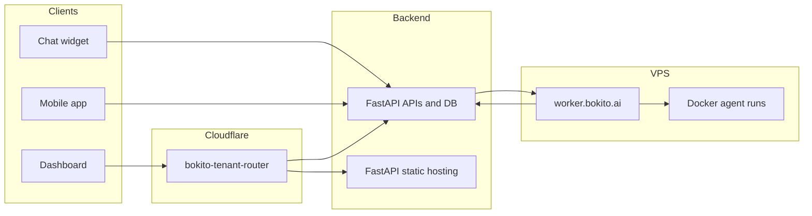

# Platform overview

Last updated: May 2026

Bokito is the **unified operational flow** for AI-driven SMBs: customer signals, agent orchestration, and human approvals in one system — with **governed autonomy** you can dial from manual oversight toward AI running operations with humans at the exception layer. See [`docs/POSITIONING.md`](../POSITIONING.md) for market framing.

## Applications

| Application | Type | Primary user |
|-------------|------|--------------|
| **Dashboard (portal)** | React web app | Admin, operations manager |
| **Mobile app** | Expo (React Native) | End user, field staff |
| **Chat widget** | TypeScript IIFE embed | Website visitor, customer |
| **Marketing website** | Static site | Prospective customer |

The dashboard is the control center for tenant configuration, inbox, workforce agents, integrations, and workspace documentation. The widget and mobile app connect to FastAPI livechat APIs. Background agents run on a VPS runtime orchestrated from FastAPI crons.

## Tech stack

| Layer | Technology |
|-------|------------|
| Dashboard | React, TypeScript, Vite, React Router, Tailwind CSS |
| Mobile | React Native, Expo Router |
| Widget | Vanilla TypeScript, Vite IIFE bundle, SSE streaming |
| Backend | FastAPI (API, database, AI agents, MCP servers, static hosting) |
| Worker runtime | Node.js on VPS, BullMQ, Redis, Docker agent containers, Ollama embeddings |
| Edge | Cloudflare Workers (`bokito-tenant-router`, `bokito-app-passthrough`) |
| Real-time | Server-Sent Events (SSE) for AI responses and live work logs |

**FastAPI API base (example):** `https://api.bokito.nl`

## Repository layout

```
apps/
  dashboard/     Portal (primary product UI)
  chat-widget/   Embeddable web chat
  runtime/       VPS worker (agent runs, indexing)
  mobile/        Expo mobile app
cloudflare-workers/
  bokito-tenant-router/   Tenant subdomain routing
  bokito-app-passthrough/ Control-plane static passthrough
docs/
  company/       This handbook
  phase-0-infrastructure.md
packages/
  shared/        Shared types/utilities
  docker/agent-run/  Agent container image
docs/archived/    legacy patches, tables, deploy notes (historical)
```

Source code is hosted on GitHub: [github.com/BokitoAI/Bokito-AI](https://github.com/BokitoAI/Bokito-AI).

## High-level architecture



## Local development (quick reference)

| Host | Purpose |
|------|---------|
| `app.localhost:5174` | Control plane (login, workspace hub) |
| `<slug>.localhost:5174` | Tenant product UI (e.g. `bokito.localhost:5174`) |
| `127.0.0.1:8787` | Chat widget dev server |

Dashboard: `cd apps/dashboard && npm run dev`. Widget: build `apps/chat-widget` first if testing embed in the portal.

## Related docs

- [02 – Tenant and hosting](02-tenant-and-hosting.md)
- [09 – Infrastructure and deploy](09-infrastructure-and-deploy.md)
- [README](README.md)
